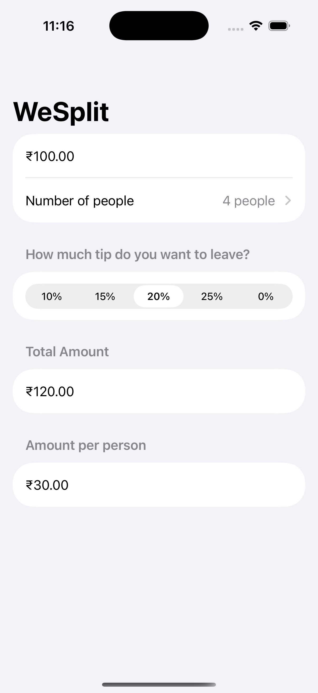

# WeSplit 💵

A clean, modern iOS check-splitting and tip calculator app built with **SwiftUI**.

WeSplit makes it effortless to calculate tips and split bills with friends. Simply enter the total check amount, select the tip percentage, choose the number of people, and let the app handle the rest.

---

## 📱 Preview

<p align="center">
  
</p>

---

## ✨ Features

- **Dynamic Currency Formatting**: Automatically formats the check amount according to the user's local currency code.
- **Split Among Friends**: Easily select the party size (from 2 up to 99 people).
- **Tip Selection**: Segmented control for quick tip selection (10%, 15%, 20%, 25%, or 0%).
- **Instant Grand Total**: Live computation of the total bill including tip.
- **Per-Person Breakdown**: Clear calculation of exactly what each person owes.
- **Smooth Input UX**: Integrated keyboard toolbar with a "Done" button to dismiss the decimal keypad easily.

---

## 🛠 Tech Stack & Concepts

- **Language:** Swift 5.9+
- **Framework:** SwiftUI
- **Architecture:** Declarative UI with state-driven reactive design
- **Key Concepts:**
  - `@State` property wrappers for reactive state binding
  - `@FocusState` for programmatic keyboard management
  - Computed properties for real-time calculations (`grandTotal`, `totalPerPerson`)
  - SwiftUI controls: `Form`, `Section`, `TextField`, `Picker`, `NavigationStack`, `toolbar`

---

## 🚀 Getting Started

### Prerequisites

- macOS Sonoma or later
- Xcode 15.0 or later
- iOS 17.0+ Simulator or physical device

### Installation

1. **Clone the repository:**
   ```bash
   git clone git@github.com:selva7378/WeSplit.git
   cd WeSplit
   ```

2. **Open the project in Xcode:**
   ```bash
   open WeSplit.xcodeproj
   ```

3. **Run the App:**
   - Select your target simulator or connected iOS device in Xcode.
   - Press `Cmd + R` to build and run.

---

## 📂 Project Structure

```text
WeSplit/
├── WeSplit.xcodeproj         # Xcode project configuration
├── WeSplit/                  # Source files
│   ├── WeSplitApp.swift      # Application entry point (@main)
│   ├── ContentView.swift     # Main calculator view & business logic
│   └── Assets.xcassets       # App icons and color assets
├── screenshots/              # App screenshots for documentation
└── README.md                 # Project documentation
```

---

## 👤 Author

- **Selva Ganesh** - [GitHub](https://github.com/selva7378)
